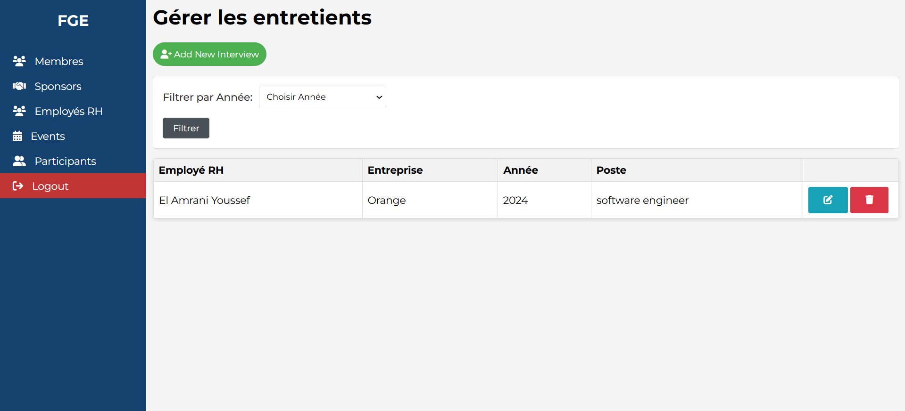

# Web App Usage Guide

## Prerequisites
- Python installed on your system
- Flask library
- MySQL installed and running
- The repository cloned to your local machine

## Steps to Set Up and Use the Web App

1. **Clone the Repository**  
   Open a terminal and run:
   ```bash
   git clone https://github.com/Anass-Fajoui/FGE_WebAPP.git
   ```
   
2. **Install Flask**  
   Navigate to the cloned repository folder:
   ```bash
   cd FGE_WebAPP
   ```
   Then install Flask:
   ```bash
   pip install flask
   ```

3. **Import the Database**  
   Open your MySQL Workbench and import the database file `fge.sql` from the repository.  
  
4. **Run the Web App**  
   Make sure you are in the repository folder, if not:
   ```bash
   cd FGE_WebAPP
   ```
   Then start the Flask app:
   ```bash
   flask run
   ```
   A local server will be created. The terminal will display a URL, typically something like `http://127.0.0.1:5000`.

5. **Access the Web App**  
   Open a web browser and go to the displayed URL to access and use the web app.
   Or in the terminal just  `ctrl+click` or maybe `alt+click`

---

### NB

- Update the database configuration in the `app.py` (e.g., username, password, database name) .
- The credentials for accessing the dashboard are: `admin` as the username and `yourpassword` as the password.

# FGE Web App- Screenshot Collection

<div style="display: flex; flex-wrap: wrap;align-items:flex-start; gap: 10px;">
  
  
  
  
  
  
  
  
  
  
  
</div>


